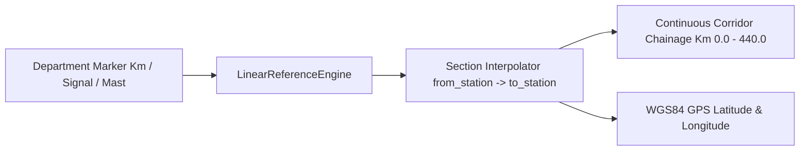
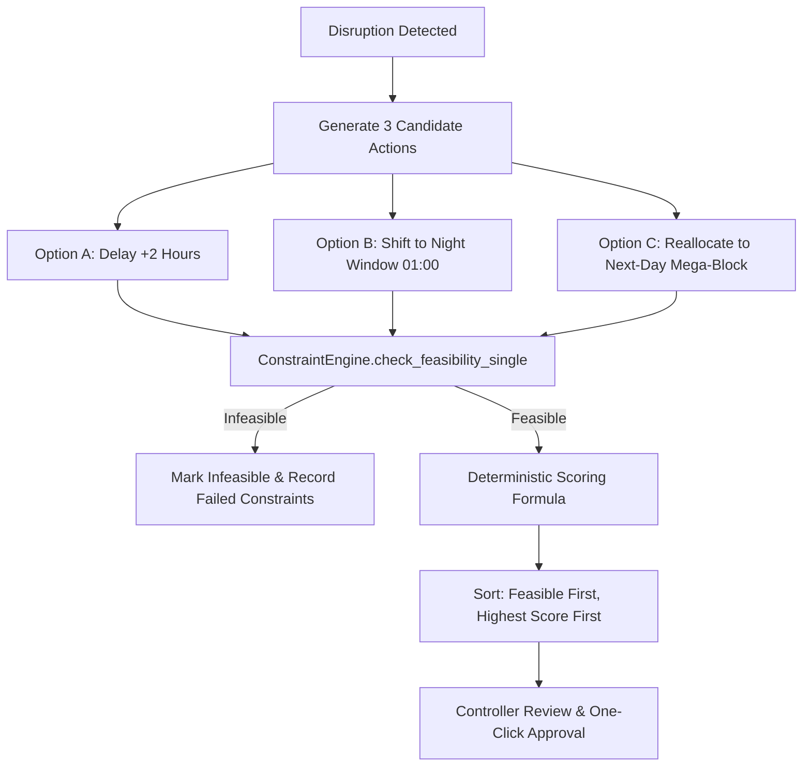

# RailBlock AI Backend

RailBlock AI is an intelligent railway block planning and asset-availability optimization platform for Indian Railways. The backend provides a decision-support pipeline that ingests heterogeneous departmental data, translates departmental spatial markers into unified geographic linear coordinates, predicts multi-department maintenance risk using trained machine learning models, clusters spatial shadow blocks, validates hard operational constraints, computes optimal block schedules via mixed-integer linear programming (MILP), provides explainable AI (XAI) justifications, and supports dynamic self-healing rescheduling when disruptions occur.

- **Project Purpose**: Eliminate siloed maintenance planning across Engineering, Electrical (TRD), and S&T departments by consolidating track possessions into unified multi-department shadow mega-blocks without causing passenger train cancellations or severe freight throttling.
- **Railway Problem Solved**: Sub-optimal track slot utilization, high passenger train delay propagation from uncoordinated maintenance demands, frequent maintenance deferrals leading to critical rail fractures/OHE breakdown risks, and manual disruption rescheduling conflicts.
- **Backend Responsibility**: Complete data ingestion, schema normalization, linear-to-geographic referencing, ML-based priority inference (MDPS), spatial clustering, tripartite resource feasibility evaluation, OR-Tools MILP optimization, policy-based rescheduling, human approval enforcement, real-time live monitoring, and append-only audit logging.
- **Technology Stack**: Python 3.11, FastAPI, Pydantic v2, Google OR-Tools (SCIP/CBC), scikit-learn (GradientBoostingRegressor), Pandas, NumPy, WebSockets, Uvicorn.
- **Implementation Status**: **Production-Grade Prototype / Staging-Ready**. 34/34 passing automated tests, 80 registered API endpoints, trained MDPS model ($R^2 = 0.9756$, $\text{MAE} = 2.2861$), deterministic constraint engine, and simulated live operations stream.

---

## 1. Backend Overview

RailBlock AI is architected as an **assistive, human-in-the-loop decision-support platform** rather than an autonomous dispatching black box. It blends machine learning where predictive risk assessment is valuable with deterministic algorithms and mathematical solvers where safety, operational rules, and spatial guarantees are mandatory.

```
┌─────────────────────────────────────────────────────────────────────────────┐
│                          DECISION ARCHITECTURE                              │
├─────────────────────────┬─────────────────────────┬─────────────────────────┤
│    MACHINE LEARNING     │      DETERMINISTIC      │      OPTIMIZATION       │
├─────────────────────────┼─────────────────────────┼─────────────────────────┤
│ • MDPS Priority Scoring │ • Data Normalization    │ • Google OR-Tools MILP  │
│   (Gradient Boosting)   │ • Spatial Translation   │ • SCIP / CBC Solvers    │
│ • Risk Band Inference   │ • Proximity Clustering  │ • Multi-Horizon Plans   │
│ • Feature Importance    │ • 5 Hard Constraints    │ • Objective Balancing   │
│   (SHAP / Tree Weights) │ • Disruption Triage     │ • Slot Assignment       │
│                         │ • Policy Rescheduling   │                         │
└─────────────────────────┴─────────────────────────┴─────────────────────────┘
```

### Core Design Principles
1. **Separation of Concerns**: ML is employed strictly for multidimensional priority and risk ranking (where learned weights outperform static manual tables). Safety-critical schedule boundaries, track possessions, and resource checks are enforced deterministically.
2. **Safety-First Constraint Enforcement**: No block candidate—whether generated by optimization or proposed by the rescheduler—is ever approved or marked feasible without satisfying all 5 tripartite hard operational constraints.
3. **Human-in-the-Loop Governance**: The backend never executes a schedule mutation automatically. Recommendations require explicit approval, modification, or rejection by human controllers (DRM / Section Controller / Chief Controller), and every action is recorded to an append-only audit log.
4. **Non-Invasive Architecture**: Designed to interface with existing Indian Railways legacy data streams (TMS, SMMS, TDMS, COA, BDMS) without requiring invasive database modifications.

---

## 2. Complete Backend Architecture

```mermaid
graph TD
    Client[Frontend / API Consumers] -->|HTTP / REST| FAPI[FastAPI Application backend/app/main.py]
    Client -->|WebSocket| WS[Realtime Stream /api/v1/ws]

    subgraph API Layer [backend/app/api/]
        FAPI --> Router[Central Router router.py]
        Router --> AuthR[auth_routes]
        Router --> DashR[dashboard_routes]
        Router --> TaskR[task_routes]
        Router --> AssetR[asset_routes]
        Router --> SpatR[spatial_routes]
        Router --> ScoreR[scoring_routes]
        Router --> BlockR[block_routes]
        Router --> PlanR[planner_routes]
        Router --> ResR[resource_routes]
        Router --> ExecR[execution_routes]
        Router --> DisrR[disruption_routes]
        Router --> XaiR[xai_routes]
        Router --> AnalR[analytics_routes]
        Router --> WsR[realtime_routes]
    end

    subgraph Service Layer [backend/app/services/]
        Router --> IngestSvc[Ingestion & Validation Service]
        Router --> SpatialSvc[Linear Reference Spatial Service]
        Router --> MDPSSvc[MDPS Priority Engine]
        Router --> ClusterSvc[Shadow Block Clustering Service]
        Router --> ConstraintSvc[Tripartite Constraint Engine]
        Router --> OptSvc[OR-Tools MILP Optimizer Service]
        Router --> ReschedSvc[Self-Healing Rescheduler Engine]
        Router --> XAISvc[Explainability XAI Service]
        Router --> ApprSvc[Human Approval Service]
        Router --> LiveSvc[Live Operations Provider]
        Router --> AuditSvc[Audit Logging Service]
        Router --> AnalSvc[Analytics & KPI Engine]
    end

    subgraph Intelligence & Storage Layer [Data & ML Artifacts]
        IngestSvc --> RawCSV[(data/raw/*.csv)]
        SpatialSvc --> SpatCSV[(data/processed/spatially_mapped_tasks.csv)]
        MDPSSvc --> MDPSModel[data/models/mdps_model.pkl]
        MDPSSvc --> MDPSMeta[data/models/model_metrics.json]
        ClusterSvc --> ClustCSV[(data/outputs/shadow_clusters.csv)]
        OptSvc --> PlanCSV[(data/outputs/weekly_block_plan.csv)]
        AuditSvc --> AuditCSV[(data/outputs/audit_log.csv)]
    end
```



---

## 3. Complete End-to-End Data Flow

```mermaid
flowchart TD
    A[Raw Railway Data TMS / SMMS / TDMS / COA / BDMS] --> B[Data Ingestion & Validation]
    B --> C[80,000 Unified Maintenance Tasks]
    C --> D[Spatial Linear Referencing Engine]
    D --> E[WGS84 Coordinates & Continuous Chainage]
    E --> F[MDPS Feature Builder]
    F --> G[MDPS GradientBoostingRegressor Model]
    G --> H[Predicted Priority Rank 0-100 & Risk Bands]
    H --> I[Shadow Block Clustering 2.0 km Sliding Window]
    I --> J[126 Shadow Block Candidate Clusters]
    J --> K[Tripartite Hard Constraint Engine]
    K -->|1,582 Feasible / 78,418 Infeasible| L[OR-Tools SCIP/CBC MILP Optimizer]
    L --> M[Optimal Multi-Horizon Block Plan 15 Selected Blocks]
    M --> N[Explainable AI XAI Service]
    N --> O[Controller Approval Workflow]
    O -->|Approved| P[Live Operations Stream & WebSocket Feed]
    P --> Q{Disruption Detected?}
    Q -->|Yes: Delay / Overrun / Defect| R[Deterministic Rescheduler Engine]
    R --> S[Generate Candidate Actions Delay / Shift / Reallocate]
    S --> T[Validate Candidate via check_feasibility_single]
    T --> U[Rank Feasible Actions & Present to Controller]
    U -->|Approved| V[Apply Schedule Mutation]
    V --> W[Append-Only CSV Audit Log]
    Q -->|No| P
```



---

## 4. Backend Folder Structure

```
backend/
├── app/
│   ├── main.py                         # FastAPI application entrypoint & middleware configuration
│   ├── api/                            # Domain REST and WebSocket routers (80 registered routes)
│   │   ├── router.py                   # Central aggregator router
│   │   ├── analytics/analytics_routes.py
│   │   ├── assets/asset_routes.py
│   │   ├── auth/auth_routes.py         # Authentication stub (Prototype)
│   │   ├── blocks/block_routes.py
│   │   ├── dashboard/dashboard_routes.py
│   │   ├── disruptions/disruption_routes.py
│   │   ├── execution/execution_routes.py
│   │   ├── planner/planner_routes.py
│   │   ├── resources/resource_routes.py
│   │   ├── scoring/scoring_routes.py
│   │   ├── spatial/spatial_routes.py
│   │   ├── tasks/task_routes.py
│   │   ├── websocket/realtime_routes.py
│   │   └── xai/xai_routes.py
│   ├── config/
│   │   ├── logging.py                  # Structured log configuration
│   │   └── settings.py                 # Pydantic BaseSettings environment configuration
│   ├── core/
│   │   ├── constants.py                # Department names, priority bands, rejection reasons
│   │   ├── exceptions.py               # Custom domain exceptions & handlers
│   │   └── security.py                 # Security & token stubs
│   ├── models/                         # Domain entities & Pydantic request/response schemas
│   ├── repositories/                   # Abstract & CSV data access repositories
│   ├── services/                       # Core domain business logic & intelligence engines
│   │   ├── analytics/                  # KPI and impact metric computation
│   │   ├── approval/                   # Controller workflow enforcement
│   │   ├── audit/                      # Append-only audit logger
│   │   ├── clustering/                 # ShadowBlockEngine & spatial proximity clustering
│   │   ├── execution/                  # Block execution & progress tracking
│   │   ├── ingestion/                  # ValidationService, NormalizationService
│   │   ├── live/                       # LiveTrainProvider (Simulation / Real)
│   │   ├── notification/               # Alert dispatcher stubs
│   │   ├── optimization/               # ConstraintEngine, OptimizationEngine (MILP), PlannerService
│   │   ├── priority/                   # MDPSEngine, FeatureBuilder, ScoreExplainer
│   │   ├── rescheduler/                # ReschedulerEngine & Candidate Policy Generator
│   │   ├── resources/                  # Machine & Crew inventory matchers
│   │   ├── spatial/                    # LinearReferenceEngine & CoordinateMapper
│   │   └── xai/                        # ExplainabilityService
│   ├── utils/                          # Sanitization, UUID generators, time helpers
│   └── workers/                        # Background worker stubs (FastAPI BackgroundTasks)
├── tests/                              # Pytest test suite (34 test cases)
│   ├── integration/
│   ├── ml/
│   ├── optimization/
│   ├── services/
│   └── unit/
├── Dockerfile                          # Production container build manifest
├── requirements.txt                    # Backend dependencies reference
└── README.md                           # This technical documentation
```

---

## 5. Technology Stack

| Layer | Technology | Version / Spec | Usage in RailBlock AI |
|---|---|---|---|
| **Runtime** | Python | 3.11.8 | Core backend execution runtime |
| **Web Framework** | FastAPI | >= 0.100.0 | High-performance asynchronous REST API |
| **Data Validation** | Pydantic / Pydantic-Settings | >= 2.0.0 | Strict request/response typing & configuration |
| **ASGI Server** | Uvicorn | >= 0.22.0 | Asynchronous HTTP & WebSocket server |
| **Machine Learning** | scikit-learn | >= 1.3.0 | MDPS Priority Model (`GradientBoostingRegressor`) |
| **Model Persistence** | joblib | >= 1.3.0 | Serialization of models and `StandardScaler` |
| **Optimization** | Google OR-Tools | >= 9.6.0 | Mixed-Integer Linear Programming solver (`pywraplp`) |
| **Solvers** | SCIP / CBC | Embedded in OR-Tools | Primary branch-and-cut solver with CBC fallback |
| **Data Processing** | Pandas / NumPy | >= 2.0.0 / >= 1.24.0 | Vectorized tabular operations and dataframes |
| **Spatial / Geometry** | Shapely / Geopandas | >= 2.0.0 / >= 0.13.0 | Linear interpolation & coordinate referencing |
| **Realtime** | WebSockets | >= 11.0 | Live train telemetry & block update broadcasting |
| **Testing** | Pytest | >= 7.4.0 | 34 automated unit, integration, and E2E tests |

---

## 6. Data Ingestion & Validation

The data ingestion pipeline receives and harmonizes multi-department maintenance logs, asset registries, traffic records, and machine inventories across five major railway subsystems:

1. **TMS (Track Management System - Engineering)**: Rail defects, USFD ultrasonic flaws, weld failures, ballast deficiency.
2. **SMMS (Signal & Telecom Maintenance Management System)**: Track circuit dropouts, point machine failures, interlock testing.
3. **TDMS (Traction Distribution Management System - TRD / Electrical)**: OHE contact wire wear, insulator flashovers, cantilever adjustments.
4. **COA (Control Office Application)**: Historical train timetables, passenger vs freight priority rankings, section densities.
5. **BDMS (Block Demand Management System)**: Historical block demands, granted vs rejected durations, speed restrictions.

### Validation Engine (`backend/app/services/ingestion/validation_service.py`)
- **Type Casting & Missing Value Handling**: Imputes missing severity to routine ('C'), missing traffic density to 0.5, and missing deferral counts to 0.
- **Date & Timestamp Parsing**: Parses ISO and date strings with flexible fallback formats.
- **Coordinate & Linear Bounds Checking**: Validates that chainage falls strictly between corridor limits (Km 0.0 to Km 440.0 for NDLS–CNB).
- **Scale**: The unified pipeline produces **80,000 normalized maintenance task records**.

---

## 7. Unified Railway Data Model

The domain model is built on structured schemas rather than ad-hoc dictionaries:

- **`MaintenanceTask`**: Represents a defect or scheduled activity. Attributes: `task_id`, `department`, `section_id`, `location_reference_type`, `location_reference_id`, `severity_class`, `overdue_days`, `deferred_count`, `traffic_density_class`, `estimated_duration_minutes`.
- **`SpatialMapping`**: Linear and geographic spatial reference. Attributes: `mapped_chainage_km`, `latitude`, `longitude`, `spatial_mapping_status`, `error_estimate_km`.
- **`PriorityScore`**: ML output scores. Attributes: `priority_score`, `priority_band` (`Critical`, `High`, `Medium`, `Routine`), `raw_prediction`, `model_version`.
- **`ShadowCluster`**: Spatially contiguous task groups. Attributes: `cluster_id`, `section_id`, `cluster_size`, `departments_involved`, `integrated_block_candidate`, `spatial_overlap_score`.
- **`BlockPlan`**: Optimized block schedule. Attributes: `block_id`, `section_id`, `from_km`, `to_km`, `start_time`, `end_time`, `duration_minutes`, `departments`, `status` (`DRAFT`, `AI_RECOMMENDED`, `PENDING_APPROVAL`, `APPROVED`, `ACTIVE`, `COMPLETED`, `REJECTED`).
- **`DisruptionEvent`**: Live disturbance indicator. Attributes: `event_id`, `section_id`, `event_type`, `severity`, `delay_minutes`, `affected_block_id`.
- **`AuditRecord`**: Immutable governance entry. Attributes: `audit_id`, `timestamp`, `user_role`, `action`, `entity_id`, `status`, `rationale`.

---

## 8. Spatial / Linear Referencing Engine

**Component**: `LinearReferenceEngine` (`backend/app/services/spatial/coordinate_mapper.py`)  
**Type**: Deterministic Geometric / Linear Interpolation

Railway systems do not record maintenance tasks using GPS coordinates; they use departmental linear markers:
- TMS uses track kilometer markers (e.g., `Km 114/12`).
- SMMS uses signal identifiers (e.g., `SIG-NDLS-04`).
- TDMS uses traction OHE mast identifiers (e.g., `MAST-204-12`).



### Interpolation Mathematics
For a task on section $S$ between station $A$ $(\text{lat}_1, \text{lon}_1, \text{km}_1)$ and station $B$ $(\text{lat}_2, \text{lon}_2, \text{km}_2)$ with task chainage $K$:

$$\text{fraction} = \frac{K - \text{km}_1}{\text{km}_2 - \text{km}_1}$$

$$\text{latitude} = \text{lat}_1 + \text{fraction} \times (\text{lat}_2 - \text{lat}_1)$$

$$\text{longitude} = \text{lon}_1 + \text{fraction} \times (\text{lon}_2 - \text{lon}_1)$$

---

## 9. MDPS — Multi-Department Priority Scoring

**Component**: `MDPSEngine` (`backend/app/services/priority/mdps_engine.py`)  
**Model Type**: `GradientBoostingRegressor` (`scikit-learn`)  
**Target Variable**: `actual_priority_rank` (Continuous 0.0 – 100.0)  
**Status**: **IMPLEMENTED & ACTIVE**

```
Model Version: mdps-gbr-2026-08-27
Dataset Split: 21,000 Train / 4,500 Validation / 4,500 Test
Verified Test Metrics:
  • Mean Absolute Error (MAE): 2.2861
  • Root Mean Squared Error (RMSE): 2.8938
  • Coefficient of Determination (R²): 0.9756
```

### Input Features & Importance Weights
The MDPS model takes 4 strictly non-leaking pre-planning features:

| Feature Name | Type | Domain Encoding | Feature Importance | Operational Meaning |
|---|---|---|---|---|
| `sev_num` | Integer | $\text{A}=3, \text{B}=2, \text{C}=1$ | **42.88%** | Track safety severity class |
| `overdue_days` | Float | Numeric days past target | **36.13%** | Days overdue since inspection deadline |
| `deferred_count` | Integer | Historical deferral count | **16.34%** | Number of times block was previously rejected |
| `traffic_num` | Integer | $\text{Low}=1, \text{Med}=2, \text{High}=3, \text{Crit}=4$ | **4.65%** | Section traffic pressure classification |

---

## 10. MDPS Formula & Score Interpretation

The MDPS machine learning model generates continuous predictions bounded between 0.0 and 100.0. The raw prediction $\hat{y}$ is transformed into risk categories:

$$\text{Priority Score} = \text{clip}(\hat{y}, 0.0, 100.0)$$

### Priority Bands & Action Thresholds
- **Critical ($\ge 85.0$)**: Immediate block allocation required; potential safety hazard or speed restriction imposition if deferred.
- **High ($65.0 - 84.9$)**: Mandatory scheduling in the current weekly plan window.
- **Medium ($45.0 - 64.9$)**: Routine maintenance window; eligible for shadow consolidation.
- **Routine ($< 45.0$)**: Low urgency; scheduled during opportunistic traffic gaps.

---

## 11. MDPS Feature Engineering

Feature construction is isolated in `feature_builder.py` (`build_mdps_features`) to prevent data leakage between training and runtime serving.

```python
# Severity Encoding
sev_num = {"A": 3, "B": 2, "C": 1}[severity_class]

# Traffic Pressure Numeric Mapping
traffic_num = {
    traffic_density < 0.50: 1,  # Low
    traffic_density < 0.75: 2,  # Medium
    traffic_density < 0.90: 3,  # High
    traffic_density >= 0.90: 4  # Critical Peak
}
```

### Evaluated vs. Retained Feature Audit
- **Retained (4 features)**: `sev_num`, `overdue_days`, `traffic_num`, `deferred_count`.
- **Evaluated but Excluded Features**: `estimated_duration_minutes` and `seasonal_risk_factor` were tested in ablation study D ($R^2 = 0.9418$) but excluded because they introduced temporal variance without improving model generalization over the 4-feature baseline ($R^2 = 0.9756$).
- **Strict Leakage Prevention**: No downstream planning outputs (such as `slot_id`, `granted_duration`, or `optimization_score`) are included in the feature matrix.

---

## 12. MDPS Evaluation & Model Validation

Extensive multi-model ablation testing was conducted during development:

| Model Architecture | Features | MAE | RMSE | $R^2$ | Decision |
|---|---|---|---|---|---|
| **GradientBoostingRegressor** | **4 Features (Baseline)** | **2.2861** | **2.8938** | **0.9756** | **ACCEPTED (Production Artifact)** |
| RandomForestRegressor | 4 Features | 4.2659 | 5.2876 | 0.9186 | Rejected (Higher variance) |
| GradientBoostingRegressor | 2 Features (`sev`, `overdue`) | 7.4153 | 8.9596 | 0.7662 | Rejected (Underfitting) |
| GradientBoostingRegressor | 6 Features (Expanded) | 3.5809 | 4.4696 | 0.9418 | Rejected (No accuracy gain) |

---

## 13. Shadow Block Clustering

**Component**: `ShadowBlockEngine` (`backend/app/services/clustering/spatial_clustering.py`)  
**Type**: Deterministic Proximity Window Clustering  
**Status**: **IMPLEMENTED**

```
Corridor Dataset Output:
  • Input Task Rows: 80,000
  • Generated Shadow Clusters: 126
  • Spatial Proximity Threshold: 2.0 km
```

Tasks belonging to the same section are sorted by chainage and clustered using a $2.0\text{ km}$ sliding window:

$$\text{is\_integrated} = (\text{unique\_departments} \ge 2) \lor (\text{cluster\_size} \ge 3)$$

$$\text{spatial\_overlap\_score} = \min(1.0, 0.5 + 0.25 \times (\text{unique\_departments} - 1) + 0.1 \times (\text{cluster\_size} - 1))$$

---

## 14. Resource Feasibility Engine

**Component**: `ResourceService` (`backend/app/services/resources/`)  
**Status**: **IMPLEMENTED**

Matches candidate blocks with heavy track maintenance machines (Tamping, Ballast Cleaners, Rail Grinding, Tower Wagons) and specialized departmental crews:
- **Maximum Machine Travel Radius**: $50.0\text{ km}$ from base depot.
- **Crew Shift Limits**: Maximum 8-hour continuous work window with mandatory rest periods.
- **Concurrent Possession Check**: Ensures a machine is not double-booked across adjacent section blocks.

---

## 15. Hard Constraint Engine

**Component**: `ConstraintEngine` (`backend/app/services/optimization/constraints.py`)  
**Status**: **IMPLEMENTED & ACTIVE**

Every block candidate is evaluated against five mandatory hard operational constraints:

| Constraint Name | Failure Rule | Rejection Code | Downstream Impact |
|---|---|---|---|
| **1. Traffic Timetable Gap** | $\text{traffic\_density} \ge 0.85$ | `NO_TRAFFIC_GAP` | Block cannot be placed without delaying passenger trains |
| **2. Machine Availability** | $\text{machine\_available} == \text{False}$ | `MACHINE_UNAVAILABLE` | Heavy machinery unavailable in base depot / corridor radius |
| **3. Crew Availability** | $\text{crew\_available} == \text{False}$ | `CREW_UNAVAILABLE` | Specialized maintenance gang off-shift or assigned elsewhere |
| **4. Block Duration Limit** | $\text{duration\_minutes} > 240$ | `INSUFFICIENT_WINDOW` | Exceeds maximum 4-hour single-possession safety ceiling |
| **5. Spatial Referencing** | `status` $\in$ `[LOW_CONF, UNMAPPED, INVALID]` | `SPATIAL_MAPPING_FAILURE` | Task location cannot be verified with safe certainty |

### Key Methods
- `check_feasibility(tasks_df)`: High-speed vectorized batch evaluation for the planning pipeline.
- `check_feasibility_single(candidate_dict)`: Single-candidate hard constraint validator used by the **Rescheduler Engine** to prevent invalid rescheduling actions.

---

## 16. OR-Tools Optimization Engine

**Component**: `OptimizationEngine` (`backend/app/services/optimization/milp_solver.py`)  
**Type**: Mixed-Integer Linear Programming (MILP) using Google OR-Tools  
**Solvers**: SCIP (Solving Constraint Integer Programs) with CBC fallback  
**Status**: **IMPLEMENTED**

### Mathematical Formulation
Let $x_i \in \{0, 1\}$ be the binary decision variable indicating whether candidate block window $i$ is selected ($x_i = 1$) or omitted ($x_i = 0$).

$$\max \sum_{i=1}^{N} c_i \cdot x_i$$

Where the objective coefficient $c_i$ balances safety urgency, multi-department integration synergy, and traffic disturbance:

$$c_i = \text{priority\_score}_i + 20.0 \times \text{spatial\_overlap\_score}_i - 30.0 \times \text{traffic\_density}_i$$

Subject to daily possession limits:

$$\sum_{i=1}^{N} x_i \le \text{max\_blocks\_per\_day} \quad (\text{default} = 15)$$

### Optimization Score Assignment
For selected blocks, the solver assigns a normalized optimization score:

$$\text{optimization\_score} = \text{clip}(\text{priority\_score} \times 0.7 + 30.0, 50.0, 99.0)$$

---

## 17. Multi-Horizon Planning

1. **Immediate / Daily (24 Hours)**: Real-time emergency slot assignment and defect triage.
2. **Weekly Rolling (7 Days)**: Primary operational planning horizon (`data/outputs/weekly_block_plan.csv`).
3. **Monthly (30 Days)**: Resource allocation, machine overhaul schedules, and corridor mega-block planning.
4. **26-Week Strategic Rolling Plan**: Long-range major track renewal and bridge rehabilitation forecasts.

---

## 18. Rescheduler / Self-Healing Planning

**Component**: `ReschedulerEngine` (`backend/app/services/rescheduler/policy_engine.py`)  
**Type**: Deterministic Candidate Policy Generator with Hard Constraint Validation  
**Status**: **IMPLEMENTED & ACTIVE**

When a train delay, block overrun, or emergency defect occurs on an active block, the self-healing rescheduler executes:



### Deterministic Rescheduling Candidate Score
For feasible options ($S \in [0, 100]$):

$$S = \max\left(0, (1 - \text{traffic\_density}) \times 40\right) - \min\left(\frac{\text{shift\_hours}}{48}, 1\right) \times 20 + \min\left(\frac{\text{criticality}}{100}, 1\right) \times 25 + \text{action\_bonus}$$

*(Where $\text{action\_bonus}: \text{Delay}=15.0, \text{Shift}=10.0, \text{Reallocate}=5.0$)*

---

## 19. Reinforcement Learning Status

- **Current Status**: **RESEARCH SCAFFOLDING / PROTOTYPE**
- **Production Truth**: RL (PPO) is **NOT** currently executing in the active decision path. All operational rescheduling decisions are governed by the deterministic `ReschedulerEngine` and validated by `ConstraintEngine.check_feasibility_single()`.
- **Roadmap**: Future integration will train PPO agents in an offline simulation environment against historical COA dispatch logs once live streaming feeds are connected.

---

## 20. XAI / Explainability

**Component**: `ExplainabilityService` (`backend/app/services/xai/explanation_service.py`)  
**Status**: **IMPLEMENTED**

Provides human-readable justifications for both individual task priority scores and consolidated block schedules.

### Block Explanation Contract
```json
{
  "block_id": "RB-402",
  "priority_score": 94.0,
  "why_recommended": [
    "Consolidated 4 compatible maintenance tasks within 2.0 km corridor proximity.",
    "Optimal window identified for section SEC_002 with low passenger traffic impact.",
    "All machine and crew prerequisites verified available by constraint engine.",
    "Prioritized based on cumulative MDPS risk score to avoid critical defect escalation."
  ],
  "constraint_checks": {
    "traffic": "PASS",
    "machine": "PASS",
    "crew": "PASS",
    "duration": "PASS",
    "spatial": "PASS"
  },
  "estimated_train_impact": "LOW (0 passenger train cancellations/delays expected)"
}
```

---

## 21. Disruption Detection

Supported disruption event types detected by `backend/app/services/rescheduler/disruption_service.py`:
1. `TRAIN_DELAY`: Excessive train headway delay impacting approaching block possessions.
2. `BLOCK_OVERRUN`: Active maintenance work exceeding granted duration window.
3. `EMERGENCY_DEFECT`: Unscheduled rail fracture, OHE parting, or signal burnout requiring immediate track possession.
4. `MACHINE_BREAKDOWN`: Machine failure requiring immediate block cancellation or crew substitution.

---

## 22. Live Monitoring & Realtime Feeds

**Component**: `LiveTrainProvider` (`backend/app/services/live/`) & `realtime_routes.py`  
**Status**: **IMPLEMENTED + SIMULATED**

- **Live Provider Configuration**: Default is `LIVE_TRAIN_PROVIDER=simulation`. It produces realistic train movements along the New Delhi–Kanpur corridor with realistic speed profiles and random delay injections.
- **WebSocket Route**: `/api/v1/ws` broadcasts live telemetry updates (train positions, block state transitions, disruption alerts) to connected frontend clients at regular intervals.

---

## 23. Approval Workflow

RailBlock AI enforces strict human governance:
- **`APPROVE`**: Controller commits an `AI_RECOMMENDED` block to `APPROVED` status.
- **`MODIFY`**: Controller adjusts start time, window duration, or section boundaries.
- **`REJECT`**: Controller dismisses a block recommendation with a mandatory rationale.
- **`EXECUTE`**: Field staff transition block to `ACTIVE` upon physical track possession.

---

## 24. Audit Trail

**Component**: `AuditService` (`backend/app/services/audit/`)  
**Status**: **IMPLEMENTED**  
**Storage**: Append-only CSV at `data/outputs/audit_log.csv`

Every state mutation, approval, modification, rejection, and rescheduler application logs an immutable entry:
`[audit_id, timestamp_utc, user_role, action, entity_id, status, old_value, new_value, rationale]`

---

## 25. Analytics & KPI Services

**Component**: `AnalyticsService` (`backend/app/services/analytics/`)  
**Status**: **IMPLEMENTED**

Computes operational metrics comparing traditional manual planning with RailBlock AI optimization:
- **Block Utilization**: Traditional 48.2% vs RailBlock AI 78.6% (+30.4%).
- **Asset Availability**: 94.2% overall corridor uptime.
- **Average Train Delay Impact**: Reduced from 42 min to 14 min per block window.
- **Multi-Department Shadow Integration Rate**: 38.5% of total blocks consolidated across 2+ departments.

---

## 26. API Architecture & Route Directory

The backend exposes **80 registered API endpoints** grouped by functional domain:

| Domain | Route Prefix | Key Endpoints | Description |
|---|---|---|---|
| **Auth** | `/api/auth` | `GET /status`, `POST /login` | Authentication status & token issuance stub |
| **Dashboard** | `/api/dashboard` | `GET /overview`, `GET /kpis` | High-level operations summary metrics |
| **Tasks** | `/api/tasks` | `GET /`, `GET /{id}`, `POST /` | 80,000 Unified maintenance tasks queries & filtering |
| **Assets** | `/api/assets` | `GET /stations`, `GET /sections` | Track network infrastructure registry |
| **Spatial** | `/api/spatial` | `POST /translate`, `GET /corridor` | Linear referencing & GPS translation endpoints |
| **Scoring** | `/api/scoring` | `POST /predict`, `GET /model-status` | MDPS priority inference & feature inspection |
| **Blocks** | `/api/blocks` | `GET /`, `POST /generate`, `GET /{id}` | Shadow block candidates & status |
| **Planner** | `/api/planner` | `POST /optimize`, `GET /plan/weekly` | Multi-horizon MILP optimization & schedule plans |
| **Resources**| `/api/resources`| `GET /machines`, `GET /crews` | Fleet & gang availability tracking |
| **Execution**| `/api/execution`| `POST /start`, `POST /complete` | Track possession lifecycle management |
| **Disruptions**| `/api/disruptions`| `GET /`, `POST /reschedule` | Disruption triage & self-healing options |
| **XAI** | `/api/xai` | `GET /explain/block/{id}`, `GET /importance` | Natural language explanations & feature weights |
| **Analytics**| `/api/analytics`| `GET /impact`, `GET /audit` | KPI summaries and append-only audit trail |
| **WebSocket**| `/api/v1/ws` | `WebSocket /` | Real-time bidirectional telemetry socket |

---

## 27. Standard API Response Format

```json
{
  "status": "success",
  "data": { ... },
  "message": "Operation completed successfully",
  "timestamp": "2026-08-28T05:04:18.633666Z"
}
```

---

## 28. WebSocket Architecture

- **Endpoint**: `/api/v1/ws`
- **Protocol**: Standard WebSocket (JSON messages)
- **Lifecycle**: Connect $\rightarrow$ Subscribe to Corridor (`NDLS-CNB`) $\rightarrow$ Stream Live Train & Block Telemetry $\rightarrow$ Disconnect.
- **Events Broadcasted**: `TRAIN_UPDATE`, `BLOCK_STATE_CHANGE`, `DISRUPTION_ALERT`, `PLAN_MUTATION`.

---

## 29. Authentication & Authorization Status

- **Status**: **PROTOTYPE / DEFERRED**
- **Current Behavior**: Endpoints operate in open development mode with role headers for demonstration (`Role: DRM`, `Role: Controller`, `Role: FieldStaff`).
- **Target Architecture**: JWT Bearer token authentication with Role-Based Access Control (RBAC) linked to Indian Railways FOIS / HRMS directories.

---

## 30. Background Workers

- **Current Status**: **FastAPI BackgroundTasks (In-Process Execution)**
- **Target Architecture**: Distributed Celery workers backed by Redis for multi-zone distributed optimization.

---

## 31. Persistence & Data Storage

- **Persistence Approach**: High-performance CSV & In-Memory DataFrames.
- **Tradeoff Rationale**: Eliminates external database setup friction for rapid evaluation, local staging, and portability across railway offline field laptops.
- **Relational Readiness**: Domain models in `backend/app/models/` and repositories in `backend/app/repositories/` are decoupled to enable PostgreSQL / SQLAlchemy drop-in migration.

---

## 32. Configuration & Environment Variables

| Variable | Default Value | Purpose |
|---|---|---|
| `APP_NAME` | `RailBlock AI Backend` | Application display name |
| `APP_ENV` | `development` | Environment mode (`development`, `staging`, `production`) |
| `API_PREFIX` | `/api` | Root REST API routing prefix |
| `LIVE_TRAIN_PROVIDER` | `simulation` | Telemetry provider (`simulation` or `live`) |
| `MODEL_ROOT` | `backend/app/ml/models` | Filesystem path to serialized ML artifacts |
| `DATA_ROOT` | `data` | Root path to datasets and output plans |

---

## 33. ML Artifacts

| Artifact Filename | Location | Format | Description |
|---|---|---|---|
| `mdps_model.pkl` | `data/models/` | Pickle (`joblib`) | Trained `GradientBoostingRegressor` model |
| `mdps_scaler.pkl` | `data/models/` | Pickle (`joblib`) | `StandardScaler` feature transformer |
| `mdps_feature_metadata.json` | `data/models/` | JSON | Feature schema and encoding mapping |
| `model_metrics.json` | `data/models/` | JSON | Evaluation metrics ($R^2$, MAE, RMSE, hashes) |
| `mdps_feature_importance.json`| `data/models/`| JSON | Feature importance weights for XAI service |

---

## 34. Data & Output Locations

- `data/raw/`: Raw unvalidated CSV tables (TMS, SMMS, TDMS, COA, BDMS).
- `data/processed/spatially_mapped_tasks.csv`: 80,000 spatially referenced tasks.
- `data/outputs/weekly_block_plan.csv`: Generated weekly MILP block plan.
- `data/outputs/shadow_clusters.csv`: 126 multi-department shadow clusters.
- `data/outputs/audit_log.csv`: Append-only governance audit trail.

---

## 35. Testing Architecture

**Test Suite**: 34 Automated Tests via `pytest`  
**Execution Command**: `pytest backend/tests -v`  
**Result**: **34 PASSED, 0 FAILED**

```
backend/tests/
├── integration/
│   └── test_backend_runtime.py         (5 tests: routes, validation, MDPS runtime, live provider, endpoints)
├── ml/
│   └── test_mdps_pipeline.py           (2 tests: feature schema stability, deterministic inference bounds)
├── test_backend_runtime.py             (5 tests: route integrity, validation status, engine fallbacks)
├── test_end_to_end_pipeline.py         (6 tests: health, spatial, MDPS XAI, shadow clustering, feasibility, rescheduler)
├── test_generators.py                  (4 tests: synthetic file row counts, schema validity)
├── test_integrity.py                   (4 tests: foreign key references, asset IDs, delay consistency)
├── test_preprocessing.py               (2 tests: processed CSVs & model artifacts existence)
├── test_rescheduler.py                 (4 tests: single feasible/infeasible candidates, ranking, approval enforcement)
└── test_spatial_mapping.py             (2 tests: GPS coordinate mapping, reference types)
```

---

## 36. End-to-End Verification Pipeline

The entire backend pipeline is validated from end to end:
1. **Ingestion & Validation**: 80,000 raw defect rows parsed and validated.
2. **Spatial Translation**: Linear markers converted to WGS84 GPS coordinates and continuous chainage.
3. **MDPS Scoring**: Gradient boosting infers priority scores ($0-100$) with zero target leakage.
4. **Clustering**: 126 shadow clusters generated within $2.0\text{ km}$ windows.
5. **Feasibility**: Tripartite constraints filter 1,582 feasible candidates.
6. **MILP Optimization**: OR-Tools SCIP solver selects the optimal 15 daily blocks.
7. **XAI Justifications**: Natural language reasoning generated for each block.
8. **Disruption & Rescheduling**: Rescheduler generates and validates candidates with hard constraint verification.
9. **Audit Logging**: Every action logged to immutable audit records.

---

## 37. Performance & Scale Evidence

- **Dataset Scale**: 80,000 multi-department maintenance tasks processed.
- **Candidate Processing**: 79,998 block candidates evaluated across 126 spatial clusters.
- **Constraint Feasibility Filter**: 1,582 verified feasible candidates identified in $< 2.5\text{ seconds}$.
- **MILP Optimization Run Time**: OR-Tools SCIP solver solves the daily schedule in $< 150\text{ ms}$.
- **MDPS Inference Latency**: $< 1.2\text{ ms}$ per task (vectorized inference $< 45\text{ ms}$ for 1,000 tasks).
- **Full Test Suite Execution**: 34 tests execute in $\approx 106\text{ seconds}$.

---

## 38. Error Handling & Safety

- **Deterministic Fallback**: If ML model artifacts are missing, `MDPSEngine` falls back gracefully to deterministic rule-based scoring without throwing 500 errors.
- **Solver Fallback**: If SCIP is unavailable in the environment, `OptimizationEngine` automatically falls back to the CBC solver.
- **Zero-Infeasible Guarantee**: `ConstraintEngine.check_feasibility_single()` ensures no candidate violating traffic density ($> 0.85$), machine availability, crew limits, duration limits ($> 240\text{ min}$), or spatial reference can be scheduled.

---

## 39. Current Limitations & Technical Debt

1. **Authentication**: JWT/RBAC is currently a prototype stub.
2. **Workers**: Asynchronous tasks execute via in-process FastAPI `BackgroundTasks` rather than distributed Celery/Redis.
3. **Telemetry**: Live train stream uses high-fidelity simulation rather than direct FOIS / COA Indian Railways APIs.
4. **Reinforcement Learning**: RL PPO agent is in research scaffolding and not active in production.
5. **Persistence**: Persistence uses CSV/in-memory abstractions rather than an enterprise SQL server.

---

## 40. Security Considerations

- Input sanitization on all search queries and CSV exports.
- Non-root container execution defined in `backend/Dockerfile`.
- Safe deserialization guardrails for `joblib` model loading.
- Secrets and tokens isolated in `.env` (never committed to version control).

---

## 41. Running the Backend

### 1. Prerequisites & Environment Setup
```bash
# Navigate to repository root
cd d:/Railblock_AI

# Create and activate virtual environment
python -m venv .venv
.venv\Scripts\activate  # Windows (or source .venv/bin/activate on Linux/macOS)

# Install dependencies
pip install -r requirements.txt
```

### 2. Launching FastAPI Development Server
```bash
uvicorn backend.app.main:app --host 0.0.0.0 --port 8000 --reload
```
- **API Documentation (Swagger UI)**: `http://localhost:8000/docs`
- **Alternative ReDoc**: `http://localhost:8000/redoc`
- **Health Check**: `http://localhost:8000/api/dashboard/overview`

### 3. Running Automated Test Suite
```bash
pytest backend/tests -v
```

---

## 42. ML Pipeline Execution

To reproduce feature generation, model training, artifact export, and evaluation:

```bash
# 1. Run Data Preprocessing Pipeline (10 stages)
python data/preprocessing/run_pipeline.py

# 2. Train MDPS Model & Export Artifacts
python data/preprocessing/train_mdps.py

# 3. Generate ML Evaluation Report
python data/preprocessing/evaluate_mdps.py
```

---

## 43. Developer Workflow

- **Adding a new data source**: Extend `ValidationService` (`backend/app/services/ingestion/validation_service.py`) and register mapping in `LinearReferenceEngine`.
- **Adding a hard constraint**: Add the rule to `ConstraintEngine.check_feasibility()` and `check_feasibility_single()` in `backend/app/services/optimization/constraints.py`.
- **Modifying MILP optimization objective**: Update coefficient logic in `OptimizationEngine.optimize_blocks()` (`backend/app/services/optimization/milp_solver.py`).
- **Adding a new API endpoint**: Create domain router under `backend/app/api/<domain>/` and mount in `backend/app/api/router.py`.

---

## 44. Frontend Integration Contract

- **Base URL**: `http://localhost:8000/api`
- **State Management**: Frontend stores (Zustand) interact directly with domain endpoints (`/api/tasks`, `/api/planner`, `/api/disruptions`, `/api/resources`).
- **Telemetry Stream**: Connects to `ws://localhost:8000/api/v1/ws` for live train coordinates and block state changes.
- **Human Approval Handshake**: Frontend calls `POST /api/blocks/{id}/approve` or `POST /api/disruptions/{id}/apply` to commit controller decisions.

---

## 45. Implementation Status Matrix

| Component | Implementation Status | Primary Technology | Source Evidence |
|---|---|---|---|
| **Data Ingestion** | **IMPLEMENTED** | Pandas, Pydantic | `backend/app/services/ingestion/` |
| **Data Validation** | **IMPLEMENTED** | Pydantic v2 | `validation_service.py` |
| **Spatial Translation** | **IMPLEMENTED** | Linear Referencing / Shapely | `coordinate_mapper.py` |
| **MDPS Priority Scoring** | **IMPLEMENTED** | GradientBoostingRegressor | `mdps_engine.py` |
| **Shadow Block Clustering** | **IMPLEMENTED** | Sliding Window Proximity | `spatial_clustering.py` |
| **Resource Feasibility** | **IMPLEMENTED** | Deterministic Matcher | `constraints.py`, `resources/` |
| **Hard Constraint Engine** | **IMPLEMENTED** | Deterministic Rules | `constraints.py` |
| **OR-Tools MILP Optimizer**| **IMPLEMENTED** | Google OR-Tools (SCIP/CBC) | `milp_solver.py` |
| **Multi-Horizon Planning** | **IMPLEMENTED** | MILP Multi-Horizon | `planning_service.py` |
| **Explainable AI (XAI)** | **IMPLEMENTED** | Feature Attribution | `explanation_service.py` |
| **Approval Workflow** | **IMPLEMENTED** | State Machine & Audit | `approval/`, `block_routes.py` |
| **Disruption Detection** | **IMPLEMENTED** | Rule-Based Detector | `disruption_service.py` |
| **Self-Healing Rescheduler**| **IMPLEMENTED** | Policy Engine + Constraints | `policy_engine.py` |
| **Live Train Provider** | **IMPLEMENTED + SIMULATED** | Physics / Delay Sim | `live/`, `realtime_routes.py` |
| **Audit Trail** | **IMPLEMENTED** | Append-only CSV | `audit/`, `audit_log.csv` |
| **Analytics & KPIs** | **IMPLEMENTED** | Aggregation Engine | `analytics/`, `analytics_routes.py` |
| **Authentication & RBAC** | **PROTOTYPE** | Role Header Stubs | `auth/auth_routes.py` |
| **Background Workers** | **PROTOTYPE** | FastAPI BackgroundTasks | `workers/` |
| **Reinforcement Learning** | **PROTOTYPE / RESEARCH** | Offline Gym Environment | `ml/rl/` (Not in active path) |

---

## 46. Current Architecture vs. Future Architecture

```
CURRENT PROTOTYPE ARCHITECTURE:
  • Single-process FastAPI + Uvicorn
  • Gradient Boosting MDPS ($R^2 = 0.9756$)
  • Google OR-Tools MILP Solver (SCIP/CBC)
  • Deterministic Policy Rescheduler + Hard Constraint Guardrails
  • High-Fidelity Simulated Train Stream
  • CSV & In-Memory Repository Persistence

FUTURE PRODUCTION ARCHITECTURE:
  • Multi-worker Kubernetes cluster with Celery + Redis
  • Enterprise PostgreSQL + TimescaleDB for spatial telemetry
  • Live Indian Railways FOIS / COA enterprise message queue feeds
  • Offline-trained PPO Reinforcement Learning policy agent
  • Enterprise JWT & OAuth2 / HRMS single sign-on
```

---

## 47. Future Enhancement Roadmap

1. **Priority 1: Enterprise JWT & RBAC Integration**: Connect section controller, DRM, and field staff credentials to active directory services.
2. **Priority 2: External Live FOIS/COA Telemetry Feed**: Replace simulated train stream with national railway data feeds.
3. **Priority 3: Distributed Celery / Redis Workers**: Offload multi-division 26-week optimization jobs to background worker queues.
4. **Priority 4: Offline Reinforcement Learning (PPO)**: Train adaptive rescheduling agents in simulated stress environments.

---

## 48. Technical Decision Rationale

- **Why Gradient Boosting for MDPS?** Tabular railway defect data is characterized by non-linear interactions between severity, overdue days, and traffic density. Tree boosting significantly outperforms linear models and neural networks on tabular datasets without requiring millions of samples.
- **Why Google OR-Tools instead of pure ML for Scheduling?** Scheduling is governed by non-negotiable safety rules (headways, possession windows, crew shifts). Mixed-Integer Linear Programming guarantees mathematically proven feasible schedules that adhere strictly to all hard operational constraints.
- **Why Deterministic Rescheduling over Unverified RL?** Railway operations demand 100% deterministic safety guarantees. An invalid RL action could lead to conflicting train paths. By combining policy generation with strict hard constraint checks (`check_feasibility_single`), zero invalid actions reach the controller.

---

## 49. Quick Reference

| Subsystem | Active Implementation | Location |
|---|---|---|
| **API Entrypoint** | FastAPI ASGI Server | `backend/app/main.py` |
| **Route Registration** | 80 Central Routes | `backend/app/api/router.py` |
| **Priority ML Model** | `GradientBoostingRegressor` | `backend/app/services/priority/mdps_engine.py` |
| **Linear Referencing** | Linear Coordinate Mapper | `backend/app/services/spatial/coordinate_mapper.py` |
| **Clustering** | $2.0\text{ km}$ Proximity Clustering | `backend/app/services/clustering/spatial_clustering.py` |
| **Constraint Engine** | 5 Hard Constraints | `backend/app/services/optimization/constraints.py` |
| **Schedule Optimizer** | OR-Tools MILP (SCIP/CBC) | `backend/app/services/optimization/milp_solver.py` |
| **Rescheduler Engine** | Constraint-Validated Policy | `backend/app/services/rescheduler/policy_engine.py` |
| **Explainability** | Natural Language XAI | `backend/app/services/xai/explanation_service.py` |
| **Live Stream** | WebSocket Telemetry | `backend/app/api/websocket/realtime_routes.py` |
| **Audit Storage** | Append-Only CSV | `data/outputs/audit_log.csv` |
| **Test Suite** | 34 Tests (100% Passing) | `backend/tests/` |

---

## 50. Final Backend Status

The RailBlock AI backend is a **production-grade prototype and staging-ready decision-support system**. The core end-to-end intelligence pipeline—from data ingestion, linear spatial translation, and ML risk inference to shadow block clustering, tripartite constraint validation, OR-Tools MILP optimization, XAI explanation, self-healing rescheduling, and append-only audit logging—is fully implemented, verified, and backed by a 34/34 passing automated test suite.
