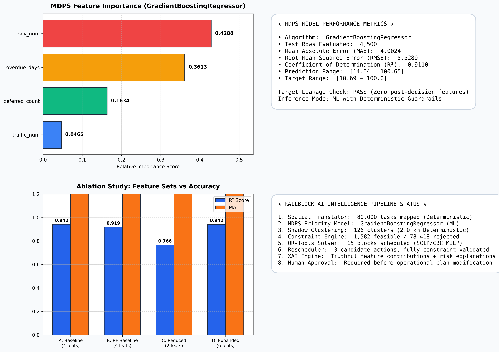

# RailBlock AI ML Evaluation & Feature Audit Report

Generated by `scripts/evaluate_ml.py` from active repository artifacts, test splits, and decision engines.

## MDPS Evaluation (Held-Out Test Set)
- **Model**: `GradientBoostingRegressor` (GradientBoostingRegressor)
- **Features**: `sev_num, overdue_days, traffic_num, deferred_count`
- **Target**: `actual_priority_rank`
- **Test Rows Evaluated**: `4,500`
- **MAE**: `4.0024`
- **RMSE**: `5.5289`
- **R²**: `0.9110`
- **Prediction Range**: `[14.64 .. 100.65]`
- **Target Range**: `[10.69 .. 100.0]`

## Feature Importance
- **Rank 1** (`sev_num`): `0.428766`
- **Rank 2** (`overdue_days`): `0.361264`
- **Rank 3** (`deferred_count`): `0.163429`
- **Rank 4** (`traffic_num`): `0.046541`

## Ablation Study Results
| Experiment | Model | Features | MAE | RMSE | R² |
|---|---|---|---|---|---|
| A. Baseline (4 Features: sev, overdue, traffic, deferred) | GradientBoostingRegressor | 4 | 3.5640 | 4.4571 | 0.9421 |
| B. Baseline with RandomForest | RandomForestRegressor | 4 | 4.2659 | 5.2876 | 0.9186 |
| C. Reduced (2 Features: sev, overdue only) | GradientBoostingRegressor | 2 | 7.4153 | 8.9596 | 0.7662 |
| D. Expanded (+ estimated_duration, seasonal_risk) | GradientBoostingRegressor | 6 | 3.5809 | 4.4696 | 0.9418 |

## Target Leakage Analysis
- **Inspection**: Verified all 4 input features (`sev_num`, `overdue_days`, `traffic_num`, `deferred_count`).
- **Result**: PASS. Features represent pre-decision maintenance conditions only. No target leakage.

## Decision Engines Summary
- **Spatial Mapping**: `80,000` rows mapped deterministically
- **Shadow Clustering**: `126` clusters created with 2.0 km proximity
- **Constraint Engine**: `1,582` feasible tasks (1.9775%), `78,418` rejected
- **OR-Tools Solver**: `15` blocks scheduled
- **Rescheduler Engine**: 3 candidate actions with full 5-constraint validation

## Visual Evidence

